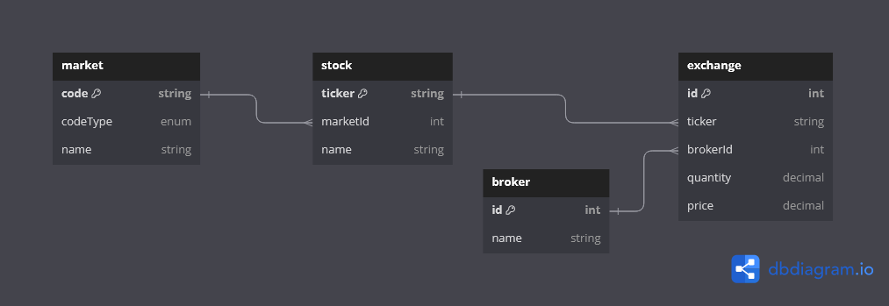

# Stock Exchange API

* A simple RESTful API that lists all the exchanges that are stored in the Datastore with Entity Framework and SQLite.
* This application will run in debug mode on Windows PCs with C: drive and uses the .NET 8 SDK. Ensure that Visual Studio is running in admin mode.
* The solution strucuture is separated in `src` and `tests`, containing the main logic and unit tests respectively. Layers have been created for the various different operations within the application.
* The project is by no means complete or production ready, although a simple run should be successful.

## Data Layer
The data layers uses Entity Framework and SQLite. Entity Framework is easy to adapt to different backends and for simplicity SQLite has been chosen. Below is a diagram of the data model.

## Notes
* There are several improvements that could have been added in its current form that are marked with comments.
* The spec requires a simple API, however in its current - simple form, it cannot satisfy the requirements for real-time notifications.
* Although, effort has been made to make the solution extensible, the time spend (just over 2 hours) was not enough to produce a scalable and resilient solution, assuming that real data would be used to feed the exchanges.